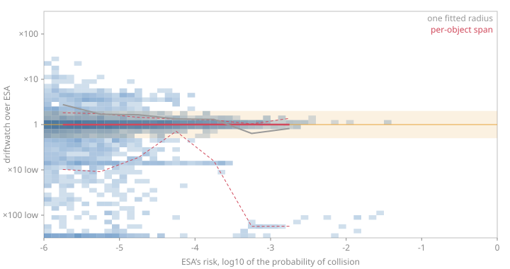

Dataset: `train_data.csv`, 10183 rows in the high-risk tail (risk >= -6).

## The hard-body radius ESA used

It is in the data. The combined radius is half of each object's `span`, added: `(t_span + c_span) / 2`, and with it the reconstruction stops being an approximation: over the tail the median residual is **-0.0003** in log10, which is 0.07% in the probability, with quartiles -0.012 to +0.008. 87% of rows agree within a factor of two and 96% within a factor of ten. The multiplier on the span is one, and no parameter is fitted on the rows this is scored on -- but the convention was recovered from these same rows, so it is confirmed on rows it never saw below, and only on that basis is it described as unfitted.

That settles the question the Phase 2 review left open. The probability code agrees with ESA's to a fraction of a percent for most conjunctions; what disagreement remains is not in the integration but in the rows described below. **What that validates is the arithmetic on ESA's inputs** -- their geometry and their covariances, through our integral -- and nothing about driftwatch's own covariance, which is fitted from element-set consistency and is not measured here at all. Agreement with ESA's column says the integral is right; it says nothing about whether the uncertainty driftwatch puts into it is.

**Restricted to the tail that matters** (risk above 1e-5, the yellow-flag threshold): 3382 rows, median residual **+0.0005**, 92% within a factor of two and 98% within a factor of ten, quartiles -0.003 to +0.005.

**The direction of the bias.** There is essentially none in the median: over the tail that matters the reconstruction is high by 0.11%, which is numerical noise rather than a bias. The residual is not symmetric, though. Its 5th percentile is -0.66 and its 95th is +0.13: the long tail is on the **low** side, so where this reconstruction disagrees it usually reads the encounter as *safer* than ESA did, by up to a factor of ten. That is the dangerous direction to be wrong in, and it is why the whole distribution is reported rather than its median. The rows in that tail are disproportionately payloads (13 % of them against 4 % of the tail), which is where the chaser-frame approximation below bites.

| Risk bin | n | median | p05 | p95 | within x2 |
| --- | ---: | ---: | ---: | ---: | ---: |
| [-6, -5) | 6801 | -0.0011 | -1.02 | +0.25 | 85% |
| [-5, -4) | 2666 | +0.0003 | -0.42 | +0.14 | 91% |
| [-4, -3) | 664 | +0.0008 | -0.81 | +0.06 | 94% |
| [-3, -2) | 44 | +0.0000 | -2.25 | +0.13 | 82% |
| [-2, 0) | 8 | -2.0063 | -2.26 | +0.00 | 38% |

The eight rows above 1e-2 are the exception: five of them come out two orders of magnitude low. At that risk the miss is comparable to the hard-body radius and the two-dimensional method is at the edge of its assumptions, so the disagreement is expected there. It is stated rather than tuned away.

### Is the one-sided tail the slow encounters?

The obvious suspect for a one-sided disagreement is the two-dimensional method itself. It assumes the pair passes in a straight line at constant velocity, which fails as the relative speed falls: a slow pair lingers near the closest approach, more of the uncertainty is in play than the one-plane integral sees, and the probability comes out too low. That is exactly the direction of the tail. So the residual is binned by relative speed.

| Relative speed | n | median | p05 | p95 | within x2 | more than 3x low |
| --- | ---: | ---: | ---: | ---: | ---: | ---: |
| 0 to 1 km/s | 238 | +0.0014 | -0.85 | +0.28 | 85% | 7.1% |
| 1 to 4 km/s | 1071 | +0.0002 | -0.85 | +0.28 | 84% | 9.5% |
| 4 to 10 km/s | 2603 | -0.0006 | -1.20 | +0.17 | 83% | 10.8% |
| 10 to 14 km/s | 3282 | -0.0005 | -0.83 | +0.30 | 85% | 8.4% |
| 14 to 20 km/s | 2989 | -0.0002 | -0.29 | +0.10 | 93% | 4.3% |

**It is not.** The slowest bin is unremarkable: 85% of it agrees within a factor of two against 93% of the fastest bin, and its 5th percentile of -0.85 is no worse than the middle of the range. What the table does show is that agreement improves monotonically towards head-on encounters at 14 km/s and above, where the geometry is least ambiguous.

The null result is worth reading carefully, because it does **not** clear the method. This comparison is against ESA's own operational risk column, and the reconstruction reproduces it to a fraction of a percent overall -- including on the slow rows. That agreement is itself the evidence: if ESA had integrated the slow encounters in three dimensions and driftwatch had not, the slow bin would stand out, and it does not. Both are computing the same two-dimensional integral, so a bias they share is invisible here whatever its size.

So the slow-encounter underestimate remains a known property of the method rather than a measured disagreement, and driftwatch flags it directly instead of inferring it from these rows: `slow_encounter` in every risk table marks the events whose transit takes more than a hundredth of an orbital period, and their probability is reported as a known underestimate. See `driftwatch.risk.pc.encounter_duration_ratio`.

### Confirmed on a held-out split

The span convention was recovered from the evaluation data itself, which makes it a fitted choice however few parameters it has, so it is checked the way a fitted parameter is: the multiplier is chosen on one set of events (smallest median absolute residual over their tail) and then scored, held fixed, on events it never saw. Halves are split by event, so no conjunction has messages on both sides. The last column is the multiplier the held-out rows would have chosen on their own (added 2026-09-05, after a second external review).

| Split | Fitted on | Multiplier chosen | Scored on | Median residual | Within x2 | Within x10 | Held-out rows' own choice |
| --- | ---: | ---: | ---: | ---: | ---: | ---: | ---: |
| training rows, first half of events to second | 4861 rows (6577 events) | 1.00x | 5322 rows (6577 events) | -0.0002 | 89% | 96% | 1.00x |
| training rows, second half of events to first | 5322 rows (6577 events) | 1.00x | 4861 rows (6577 events) | -0.0004 | 85% | 95% | 1.00x |
| training file to the challenge's test file | 10183 rows (13154 events) | 1.00x | 3263 rows (2167 events) | -0.0005 | 93% | 99% | 1.00x |

Every split chooses a multiplier of one and reproduces the rows it never saw to a median residual within 0.0005 in log10, so the convention holds out of sample and the statement above -- no parameter fitted on the rows it is scored on -- stands.

## The residual against the risk

Density of the residual over the tail with the span radius: the median solid and the 5th and 95th percentiles dashed, per risk decade, with the band marking agreement within a factor of two. The grey line is the median of the older reconstruction, which fitted one radius for every conjunction. Two things to read from it: the median sits on zero once the radius is right, and the spread is one-sided, reaching down towards safer and barely up towards riskier.

## One radius for everything, as a fallback

Kept because a catalogue without a size column still needs a number, and because it is the honest picture of what a screening tool can do when it does not know how big the objects are.

Best single hard-body radius: **9.0 m**, the radius with the smallest median absolute residual over the tail.

Residual: median **+0.224** (a factor of 1.68 high), quartiles -0.20 to +0.86, 43% within a factor of two and 80% within a factor of ten.

Over the tail that matters (risk above 1e-5): 3382 rows, median **+0.210**, a factor of 1.62 high, 54% within a factor of two. The bias has an obvious cause: with one radius for every object the reconstruction over-calls the risk of small debris and under-calls the risk of large payloads, because it gives them the same size.

| Risk bin | n | median | p05 | p95 | within x2 |
| --- | ---: | ---: | ---: | ---: | ---: |
| [-6, -5) | 6801 | +0.39 | -0.87 | +1.59 | 37% |
| [-5, -4) | 2666 | +0.22 | -0.44 | +1.55 | 53% |
| [-4, -3) | 664 | -0.17 | -0.45 | +0.93 | 58% |
| [-3, -2) | 44 | -0.12 | -0.57 | +0.77 | 36% |
| [-2, 0) | 8 | -0.52 | -0.61 | -0.23 | 12% |

## The two size columns, scored against each other

The dataset carries two size columns per object: `*_span`, the largest dimension in metres, and `*_rcs_estimate`, the radar cross-section in square metres. Each is given one free multiplier, fitted the way the single radius is, so the comparison is of the shape of the per-object radius rather than of the units.

| Proxy | Rows | Median radius | Best multiplier | Median abs. residual | Within x2 | One radius, same rows |
| --- | ---: | ---: | ---: | ---: | ---: | --- |
| `span` | 10183 | 7.00 m | 1x | 0.010 | 87% | 9.0 m: 0.431, 43% |
| `rcs` | 6758 | 1.11 m | 4.75x | 0.303 | 50% | 9.0 m: 0.447, 40% |

`span` wins at a multiplier of exactly one, which is what identifies it as ESA's own convention rather than a lucky fit. `rcs` needs a multiplier of nearly five and still does no better than a single radius: the radar cross-section is the area of the echo rather than of the object, it understates anything much larger than the radar wavelength, and it is missing on a third of the chaser rows. **This bore directly on driftwatch's own screening**, whose secondary radii used to come from `sqrt(RCS / pi)` for payloads, rocket bodies and debris. That formula has been replaced by the lookup below.

## The radius lookup driftwatch screens with

`sqrt(RCS / pi)` is gone from `risk/scenario.py`, replaced by the median chaser radius of each object type and radar cross-section class in these rows -- half the median `c_span`, since ESA's own risk column is reproduced by `(t_span + c_span) / 2` with no parameter fitted on the rows it is scored on (confirmed on the held-out splits above). The cross-section survives as a *class* (small below 0.1 m2, medium to 1 m2, large above), which is the part of it that carries size information; its use as a length does not.

| Object type | RCS class | Rows | Median radius | Used |
| --- | --- | ---: | ---: | --- |
| debris | large | 771 | 1.25 m | yes |
| debris | medium | 1889 | 1.00 m | yes |
| debris | small | 89628 | 1.00 m | yes |
| debris | unknown | 2182 | 1.00 m | yes |
| payload | large | 8427 | 4.55 m | yes |
| payload | medium | 2111 | 1.00 m | yes |
| payload | small | 4919 | 1.00 m | yes |
| payload | unknown | 41 | 1.00 m | too few rows; the type median, 1.50 m |
| rocket_body | large | 1792 | 1.90 m | yes |
| rocket_body | medium | 95 | 1.00 m | too few rows; the type median, 1.50 m |
| rocket_body | small | 25 | 1.00 m | too few rows; the type median, 1.50 m |
| rocket_body | unknown | 35 | 3.19 m | too few rows; the type median, 1.50 m |
| unknown | large | 15 | 4.50 m | too few rows; the type median, 1.00 m |
| unknown | medium | 73 | 1.00 m | too few rows; the type median, 1.00 m |
| unknown | small | 48 | 1.00 m | too few rows; the type median, 1.00 m |
| unknown | unknown | 50583 | 1.00 m | yes |

Read these as a population median, not a measurement of any one object, and note that most cells come out at exactly 1.0 m because ESA defaults an unpublished span to 2.0 m. That default is a screening convention, deliberately generous for an object whose size nobody knows. Adopting it is what makes driftwatch's probabilities comparable with ESA's, and it is the conservative direction: a conjunction with a small fragment, which `sqrt(RCS / pi)` clipped to a 0.1 m radius, now carries a 1 m radius and a probability two orders of magnitude larger. The current value is kept as a lower bound, so a large cross-section or a known envelope -- a Starlink's 10 m, the ISS's 30 m -- is never reduced to a population median.

## Maximum probability and its scaling, against ESA's own columns

- 2000 rows compared; the residual of the maximum has median +0.218 and 43% within a factor of two.
- Our scale factor over ESA's `max_risk_scaling`: median 0.9999 read as a factor on the covariance, 0.8249 read as a factor on the standard deviation. The first is one, so ESA's scaling is a factor on the covariance, as ours is.

Both are computed at the fitted single radius, so they carry that reconstruction's bias.

## What is still approximated

- The chaser's RTN frame is built from the target's and the relative velocity, with the target's velocity taken as circular. The data do not carry the target's velocity vector.
- Both covariances are used as position-only 3x3 matrices; the velocity terms play no part in the two-dimensional method.
- Rows at the risk floor of -30 are excluded from every figure here.
